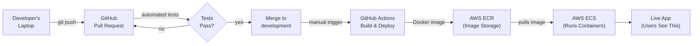
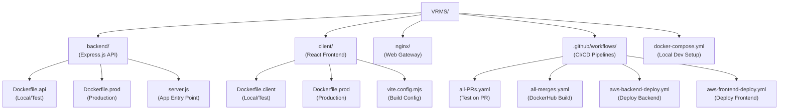
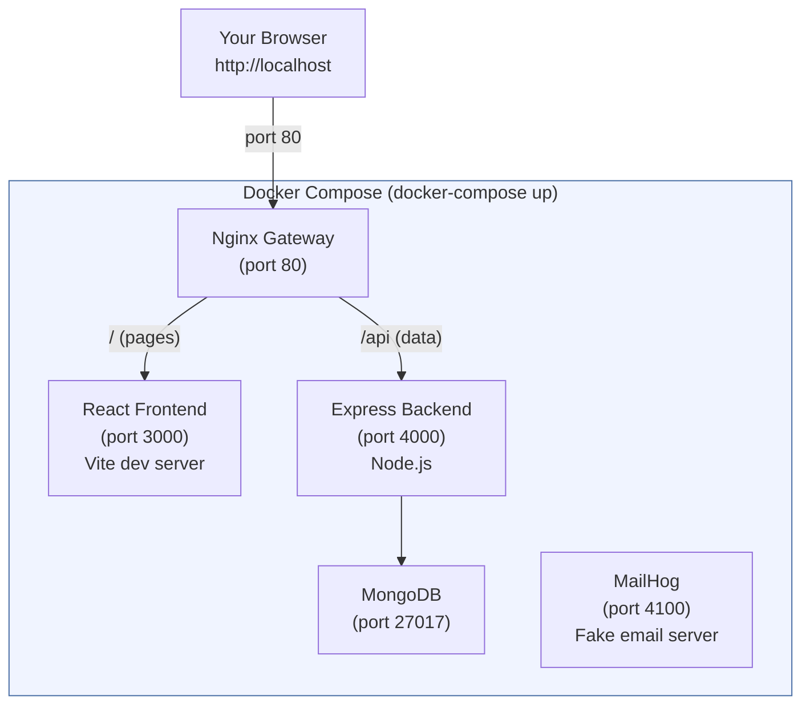
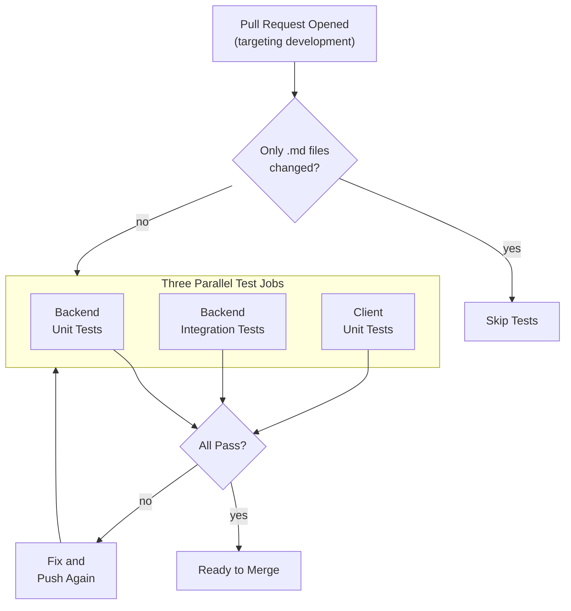
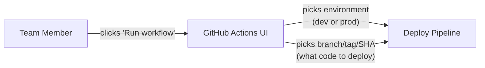
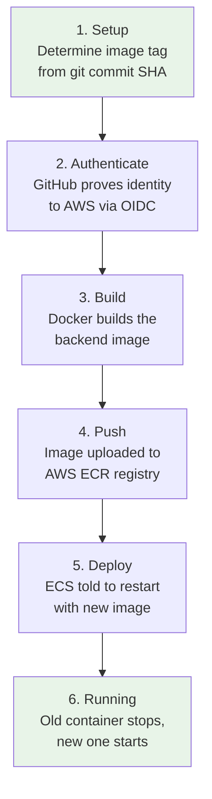
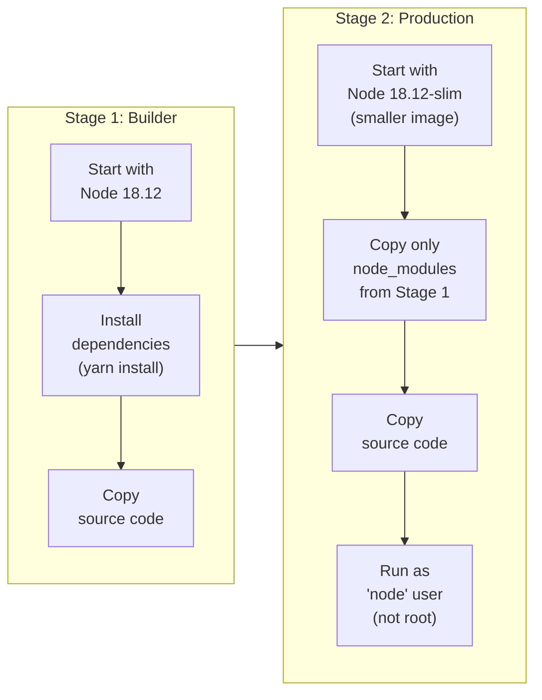
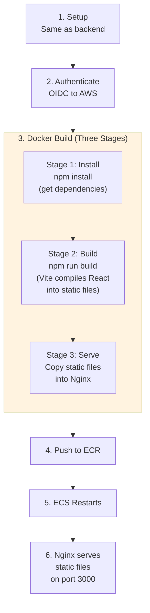
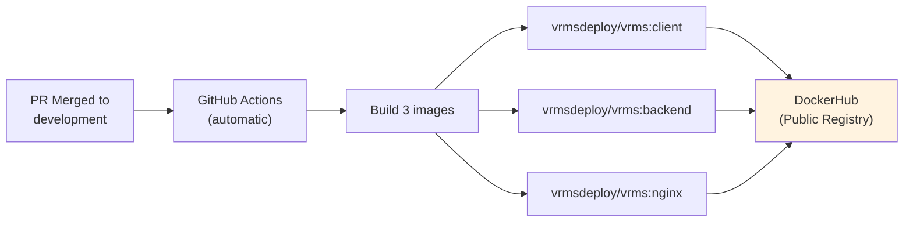
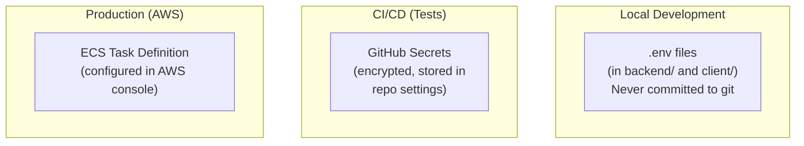

# How VRMS Gets From Your Laptop to Production

> A plain-language guide to how code moves from local development to live deployment, for both the frontend and backend.

## Table of Contents

- [The Big Picture](#the-big-picture)
- [Key Concepts (Jargon Decoder)](#key-concepts-jargon-decoder)
- [Project Structure](#project-structure)
- [Local Development](#local-development)
- [The Code Review Pipeline](#the-code-review-pipeline)
- [Deploying to AWS](#deploying-to-aws)
- [The Backend Journey](#the-backend-journey)
- [The Frontend Journey](#the-frontend-journey)
- [Legacy DockerHub Pipeline](#legacy-dockerhub-pipeline)
- [Environment Variables](#environment-variables)
- [Troubleshooting](#troubleshooting)

---

## The Big Picture

Here's the full lifecycle from writing code to users seeing it:



The short version:

1. You write code on your laptop and test it locally using Docker
2. You push your code to GitHub and open a Pull Request
3. Automated tests run to make sure nothing is broken
4. After review and merge, someone manually triggers deployment
5. GitHub Actions builds a Docker image and pushes it to AWS
6. AWS pulls the new image and restarts the app with your changes

---

## Key Concepts (Jargon Decoder)

If you're new to deployment infrastructure, here's what these terms mean:

### Docker

**What it is:** A tool that packages your app and everything it needs (Node.js, libraries, config) into a single portable "box" called a **container**. Think of it like a shipping container -- no matter what ship (server) carries it, the contents are identical.

**Why we use it:** So the app runs exactly the same way on your laptop, in tests, and in production. No more "it works on my machine" problems.

**Key terms:**
- **Dockerfile** -- A recipe that tells Docker how to build a container image (install Node, copy code, run `npm install`, etc.)
- **Image** -- The built result of a Dockerfile. Like a snapshot of your app at a point in time.
- **Container** -- A running instance of an image. The actual app serving requests.
- **Docker Compose** -- A tool that runs *multiple* containers together (frontend + backend + database) with one command.

### AWS (Amazon Web Services)

**What it is:** Amazon's cloud computing platform. We use it to run our app on Amazon's servers instead of maintaining our own.

**Services we use:**

| Service | What It Does | Analogy |
|---------|-------------|---------|
| **ECR** (Elastic Container Registry) | Stores our Docker images | Like DockerHub but private -- a warehouse for our container images |
| **ECS** (Elastic Container Service) | Runs our containers | The actual servers that run our app. Amazon manages the hardware, we just tell it what containers to run |
| **OIDC Federation** | Lets GitHub Actions authenticate to AWS without passwords | Like a VIP badge that GitHub wears so AWS knows to trust it |

### GitHub Actions

**What it is:** GitHub's built-in automation system. When certain events happen (PR opened, code merged, manual button click), it runs scripts we've defined in YAML files.

**Where the scripts live:** `.github/workflows/` directory

### CI/CD

**What it means:**
- **CI (Continuous Integration)** -- Automatically testing every code change (our PR checks)
- **CD (Continuous Deployment)** -- Automatically (or semi-automatically) deploying tested code to production

---

## Project Structure



---

## Local Development

When you run the app on your laptop, Docker Compose orchestrates four services that talk to each other:



### How to start it

```bash
docker-compose up
```

That single command:
1. Builds Docker images for the backend, frontend, and nginx (if not already built)
2. Starts all four services
3. Connects them on a shared network so they can talk to each other
4. Mounts your local code into the containers so changes appear instantly (hot reload)

### What each service does

| Service | Port | Purpose |
|---------|------|---------|
| **nginx** | 80 | Acts as a "traffic cop" -- routes browser requests to the right service. Pages go to the frontend, API calls go to the backend. |
| **client** | 3000 | The React app users see. Vite dev server provides instant hot reload as you edit code. |
| **backend** | 4000 | The Express.js API. Handles data, authentication, Slack integration, email, etc. |
| **mailhog** | 4100 | A fake email server for testing. Visit `localhost:4100` to see emails the app sends during development. |

### Code changes are instant

Your local code folders are "mounted" into the containers. This means when you edit a file on your laptop:
- **Frontend changes** -- Vite detects the change and updates the browser automatically (hot module replacement)
- **Backend changes** -- Nodemon detects the change and restarts the server automatically

No need to rebuild or restart Docker.

---

## The Code Review Pipeline

When you push code and open a Pull Request against the `development` branch, GitHub Actions automatically runs tests:



### What the tests check

1. **Backend Unit Tests** -- Tests individual functions in the backend in isolation (fast, no external services needed)
2. **Backend Integration Tests** -- Tests that the backend works correctly with Slack, Gmail, and other services (uses real API tokens stored as GitHub Secrets)
3. **Client Unit Tests** -- Tests React components render and behave correctly

### How testing works technically

Each test job:
1. Checks out your code
2. Creates a `.env` file from GitHub Secrets (so tests have API tokens)
3. Builds the Docker container
4. Runs the test suite inside the container
5. Reports pass/fail back to the PR

---

## Deploying to AWS

Deployment is **manual** -- someone with access clicks a button in GitHub Actions. This is intentional: it gives the team control over *when* new code goes live.

### The deploy button



To deploy:
1. Go to the GitHub repository's **Actions** tab
2. Select either "Backend Build and Deploy" or "Frontend Build and Deploy"
3. Click **"Run workflow"**
4. Choose the environment (`dev` or `prod`)
5. Enter the branch name, tag, or commit SHA you want to deploy
6. Click the green button

### Two environments

| Environment | Purpose | When to deploy here |
|-------------|---------|---------------------|
| **dev** | Testing environment for the team to verify changes before going live | After merging to `development`, deploy here first |
| **prod** | The live app that real users interact with | After verifying everything works in `dev` |

---

## The Backend Journey

Here's what happens step-by-step when someone deploys the backend:



### Step by step

**1. Setup** -- GitHub Actions checks out your code at the specified branch/SHA and computes a short identifier (like `a1b2c3d`) from the git commit. This becomes the image tag.

**2. Authenticate** -- Instead of storing AWS passwords in GitHub, we use OIDC (OpenID Connect). Think of it like this: GitHub shows AWS a temporary ID badge that says "I'm the VRMS repository, and I'm allowed to deploy." AWS checks the badge is legitimate, then grants temporary access. No passwords ever stored or transmitted.

**3. Build** -- Docker reads `backend/Dockerfile.prod` and builds the image:



This two-stage build keeps the final image small by throwing away build tools that aren't needed at runtime.

**4. Push** -- The built image gets two tags and is pushed to AWS ECR:
- `dev` or `prod` (so ECS knows which image to use for which environment)
- `a1b2c3d` (the commit SHA, so you can trace exactly what code is running)

**5. Deploy** -- GitHub Actions tells AWS ECS: "restart the `vrms-backend-dev` (or `-prod`) service with a fresh deployment." ECS then:
- Pulls the latest image tagged for that environment from ECR
- Starts a new container running the updated code
- Stops the old container once the new one is healthy

**6. Running** -- The backend is now live with your changes, listening on port 4000.

---

## The Frontend Journey

The frontend follows the same pattern as the backend, with one extra step: the React app needs to be *built* (compiled from JSX/TypeScript into static HTML/CSS/JS files) before it can be served.



### What makes the frontend different

The frontend has a **three-stage** Docker build:

1. **Install** -- Install npm packages (dependencies like React, Vite, Tailwind)
2. **Build** -- Run `npm run build`, which tells Vite to compile all the React components, JSX, CSS, and TypeScript into plain HTML, CSS, and JavaScript files that any browser can understand. The output goes into a `build/` folder.
3. **Package** -- Copy *only* the built files into an Nginx container. Nginx is a lightweight web server that's really good at serving static files fast. The final image doesn't even have Node.js in it -- just Nginx and your compiled app.

This means the production frontend container is tiny and fast: it's just a web server handing out pre-built files.

---

## Legacy DockerHub Pipeline

There's a second build pipeline that runs automatically when PRs merge to `development`:



This pipeline pushes images to **DockerHub** (a public container registry, like GitHub but for Docker images). It predates the AWS pipeline and may still be used by community members running VRMS locally via pre-built images. The primary production deployment path is the AWS pipeline described above.

---

## Environment Variables

The app needs various secrets and configuration values. These are stored differently depending on the context:



### Key environment variables

| Variable | Used By | Purpose |
|----------|---------|---------|
| `BACKEND_PORT` | Backend | What port the API listens on (default: 4000) |
| `DATABASE_URL` | Backend | MongoDB connection string |
| `SLACK_*` (7 vars) | Backend | Slack integration for volunteer check-ins |
| `GMAIL_*` (4 vars) | Backend | Email sending for notifications |
| `REACT_APP_PROXY` | Frontend | Where the frontend sends API requests |
| `CUSTOM_REQUEST_HEADER` | Both | Security header to verify requests are from the real app |

### Where to set them

- **Locally:** Create a `.env` file in `backend/` (copy from `.env.example` if available, or ask a team lead)
- **In CI:** Added as GitHub Secrets in the repository settings (requires admin access)
- **In production:** Configured in the AWS ECS task definition (requires AWS console access)

---

## Troubleshooting

### "Docker Compose won't start"
- Make sure Docker Desktop is running
- Try `docker-compose down` then `docker-compose up --build` to force a fresh build
- Check if ports 80, 3000, or 4000 are already in use by another app

### "Tests pass locally but fail in CI"
- CI uses GitHub Secrets for environment variables -- your local `.env` may have different values
- CI builds a fresh Docker image every time, so cached dependencies won't mask issues

### "Deploy succeeded but the app looks the same"
- ECS may take a minute or two to drain the old container and start the new one
- Check the ECS service in the AWS console to see if the new task is in "RUNNING" state
- Verify the correct branch/SHA was selected when triggering the deploy

### "I can't trigger a deploy"
- You need write access to the GitHub repository to trigger workflow dispatch
- Ask a team lead for access if you're a new contributor
