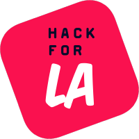

  

    
     
    <a href="https://www.vrms.io">Live Site</a>
    ·
    <a href="https://github.com/hackforla/VRMS/issues/new?labels=bug&template=bug-report---.md">Report Bug</a>
    ·
    <a href="https://github.com/hackforla/VRMS/issues/new?labels=enhancement&template=feature-request---.md">Request Feature</a>
  

# Volunteer Relationship Management System

<!-- PROJECT SHIELDS -->
<!--
*** See the bottom of this document for the declaration of the reference variables
*** https://www.markdownguide.org/basic-syntax/#reference-style-links
-->

<!-- The format for these shields is [![NAME][IMAGE-URL]][LINK-URL] -->

[![GitHub commit activity][commit-activity-shield]][commit-activity-url]
[![Contributors][contributors-shield]][contributors-url]
[![Forks][forks-shield]][forks-url]
[![Stargazers][stars-shield]][stars-url]
[![Issues][issues-shield]][issues-url]
[![MIT License][license-shield]][license-url]

VRMS is a tool used for the engagement, support, and retention of a network of volunteers.

This is an ambitious project to create a system that will help us measure our human capital development, reduce repetitive tasks and processes for leadership, and improve outcomes for both volunteers and the projects they contribute to.

<!-- TABLE OF CONTENTS -->

  
Table of Contents

  <ol>
    <li>
      <a href="#about-the-project">About The Project</a>
      <ul>
        <li><a href="#built-with">Built With</a></li>
      </ul>
    </li>
    <li><a href="#contributing">Contributing</a></li>
    <li><a href="#wiki-highlights">Wiki Highlights</a></li>  
    <!-- <li><a href="#usage">Usage</a></li> -->
    <li><a href="#roadmap">Roadmap</a></li>
    <li><a href="#license">License</a></li>
    <li><a href="#acknowledgments">Acknowledgments</a></li>
  </ol>

<!-- ABOUT THE PROJECT -->

## About The Project

VRMS is a tool originally developed to track membership attendance of meetings and evets. It's built in-house, deployed with an express backend and React frontend on AWS, and uses service workers to manage event creation and opening/closing of events.

(<a href="#readme-top">back to top</a>)

### Built With

<!-- The format for these shields is [![NAME][IMAGE-URL]][LINK-URL] -->

[![React][react-shield]][React-url]
[![AWS][aws-shield]][aws-url]
[![GitHub Actions][github-actions-shield]][github-actions-url]
[![Yarn][yarn-shield]][yarn-url]
[![Vite][vite-shield]][vite-url]
[![Docker][docker-shield]][docker-url]

(<a href="#readme-top">back to top</a>)

## Contributing

Contributions are welcome once you've been onboarded to Hack for LA through an onboarding event:

1. Join our organization by going through [Hack for LA onboarding](https://www.hackforla.org/getting-started)
    - Joining is free, and opens up access to contribute to many projects, including VRMS
2. From there, read our [CONTRIBUTING.md](https://github.com/hackforla/VRMS/blob/development/CONTRIBUTING.md) document to get started!

(<a href="#readme-top">back to top</a>)

## Wiki Highlights

1. [Introduction](https://github.com/hackforla/VRMS/wiki/Introduction)
2. [Technology Stack](https://github.com/hackforla/VRMS/wiki/Technology)
3. [Team Meetings](https://github.com/hackforla/VRMS/wiki/Team-Meetings)

(<a href="#readme-top">back to top</a>)

<!-- ROADMAP -->

## Roadmap

<!-- - [ ] Todo -->

See the [open issues](https://github.com/hackforla/VRMS/issues) and [VRMS project board](https://github.com/orgs/hackforla/projects/72) for a full list of proposed features (and known issues).

(<a href="#readme-top">back to top</a>)

## License

[AGPL-3.0 License](https://github.com/hackforla/VRMS/blob/development/LICENSE)

(<a href="#readme-top">back to top</a>)

<!-- USAGE EXAMPLES -->

<!-- ## Usage -->
<!-- Add screenshots -->
<!-- Add usage videos -->
<!-- Add login example -->

<!-- ACKNOWLEDGMENTS -->

## Acknowledgments

While GitHub provides a lot of recognition of the code commits that exist within this project, often the contributions of the organizational structure go without credit. We'd like to thank all the designers, project managers, usability testers, and data scientists that have touched this project over the years.

Thanks for all your hard work!

(<a href="#readme-top">back to top</a>)

<!-- MARKDOWN LINKS & IMAGES -->
<!-- https://www.markdownguide.org/basic-syntax/#reference-style-links -->

[commit-activity-url]: https://github.com/hackforla/VRMS/commits/development/
[commit-activity-shield]: https://img.shields.io/github/commit-activity/m/hackforla/vrms?style=for-the-badge
[contributors-shield]: https://img.shields.io/github/contributors/hackforla/VRMS.svg?style=for-the-badge
[contributors-url]: https://github.com/hackforla/VRMS/graphs/contributors
[forks-shield]: https://img.shields.io/github/forks/hackforla/VRMS.svg?style=for-the-badge
[forks-url]: https://github.com/hackforla/VRMS/network/members
[stars-shield]: https://img.shields.io/github/stars/hackforla/VRMS.svg?style=for-the-badge
[stars-url]: https://github.com/hackforla/VRMS/stargazers
[issues-shield]: https://img.shields.io/github/issues/hackforla/VRMS.svg?style=for-the-badge
[issues-url]: https://github.com/hackforla/VRMS/issues
[license-shield]: https://img.shields.io/github/license/hackforla/VRMS.svg?style=for-the-badge
[license-url]: https://github.com/hackforla/VRMS/blob/main/LICENSE.txt
[linkedin-shield]: https://img.shields.io/badge/-LinkedIn-black.svg?style=for-the-badge&logo=linkedin&colorB=555
[linkedin-url]: https://linkedin.com/in/trilliumsmith
[product-screenshot]: images/screenshot.png
[react-shield]: https://img.shields.io/badge/React-20232A?style=for-the-badge&logo=react&logoColor=61DAFB
[React-url]: https://reactjs.org/
[Site-url]: https://vrms.io

[aws-shield]: https://img.shields.io/badge/AWS-%23FF9900.svg?style=for-the-badge&logo=amazon-aws&logoColor=white
[aws-url]: https://aws.amazon.com/
[github-actions-shield]: https://img.shields.io/badge/github%20actions-%232671E5.svg?style=for-the-badge&logo=githubactions&logoColor=white
[github-actions-url]: https://docs.github.com/en/actions
[yarn-shield]: https://img.shields.io/badge/yarn-%232C8EBB.svg?style=for-the-badge&logo=yarn&logoColor=white
[yarn-url]: https://yarnpkg.com/
[vite-shield]: https://img.shields.io/badge/vite-%23646CFF.svg?style=for-the-badge&logo=vite&logoColor=white
[vite-url]: https://vitejs.dev/
[docker-shield]: https://img.shields.io/badge/docker-%230db7ed.svg?style=for-the-badge&logo=docker&logoColor=white
[docker-url]: https://www.docker.com/