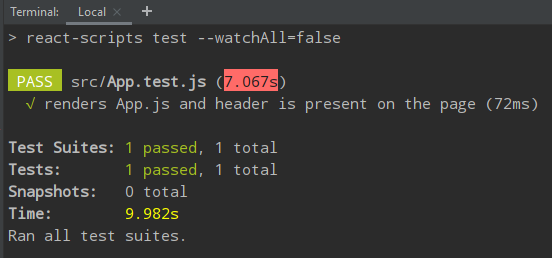

# VRMS - MVP 0.4

VRMS MVP 0.4 is a client application for MVP 0.4 features development.

## Technologies

- [React](https://reactjs.org/docs/getting-started.html)
- [Redux](https://redux.js.org/introduction/getting-started)
- [Sass](https://sass-lang.com/guide)
- [Jest](https://jestjs.io/)
- [React Testing Library](https://testing-library.com/docs/react-testing-library/intro)

## How to contribute

Please follow instructions from `vrms/README.md`.

## Get up and running (locally)

1. Make sure that you've done 6 steps from the similar section `vrms/README.md`.
 
2. Make sure you added the required environment variables (`.env`) for the `client-mvp-04` and `backend` directories. 

3. Start the local development servers (frontend & backend).
   - Navigate to the root of the application `vrms/` and run `npm run mvp`

You should now have a live app.

## Running Tests

To run all `client-mvp-04` tests:

- Navigate to the `client-mvp-04` directory
- Run `npm test` or `npm run test`

You should now see all existing tests passed.

Testing changes from a non-member

Let's create a better version of the VRMS MVP 0.4!
